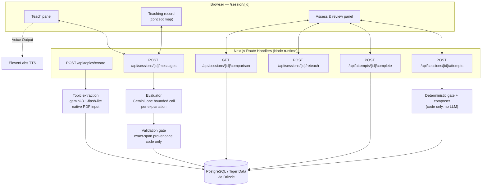

# Echo

> “If you want to master something, teach it” — Richard Feynman

Echo flips the traditional tutoring model: **you** are the teacher. Upload your own study material, explain the topic in your own words to a simulated learner, and watch it take a test based strictly on what you actually taught it.

## What it does

You upload one or more PDFs (lecture slides, notes, a study guide) and give the topic a name. Echo reads the documents and generates a teaching rubric — the concepts, misconceptions, and test questions for that subject — without ever showing you the rubric directly.

You then teach the simulated learner in your own words. After each explanation, the learner may ask a clarifying follow-up. When you're ready, you trigger an assessment: the learner answers a set of questions using *only* the concepts your explanation actually demonstrated. You can trace every wrong or incomplete answer straight back to what was and wasn't in your explanation, reteach the gap, and reassess with a second, matched set of questions to see whether the reteach actually helped.

The three panels stay in sync: **Teach** (your conversation with the learner), **Teaching record** (the concept map built from what you've verifiably taught, labelled with its record version), and **Assess & review** (the questions, answers, and before/after comparison).

## How the learner works

This is important, and we want to be precise about it: **the learner is not an LLM answering questions.** It's a rubric-driven simulation.

- Gemini is used in exactly two places: (1) once, at topic creation, to read your uploaded PDFs and generate a rubric (concepts, misconceptions, and questions) grounded in that material; and (2) once per explanation you submit, to evaluate your explanation against that rubric and extract which concepts you demonstrated, with exact quoted evidence.
- Gemini's evaluation output is validated in code (exact character-span provenance against your original words — no invented quotes are accepted) before anything is persisted.
- A separate, fully deterministic function — not an LLM — decides everything the simulated learner says and scores. It only composes an answer from concepts that the validated record marks as verifiably taught.
- The learner's score reflects how completely your explanation covered the rubric, not your own mastery of the subject, and not a proven measure of human learning. See [Known limitations](#known-limitations) and [Proposed pilot](#proposed-pilot-not-yet-run) below.

## Key features

- **Any topic, not just one fixed subject.** Upload PDFs and Echo generates a topic-specific rubric via Gemini's native PDF understanding (no separate OCR/extraction step — the PDF files are uploaded directly to the model).
- **Three-panel live UI** — Teach, Teaching record, Assess & review — that cross-highlights: selecting a concept highlights the exact words that earned it and the questions that depend on it; selecting a question highlights only the concepts blocking it.
- **Evidence-linked review.** Every review row shows the persisted question, the learner's composed answer, which criteria were earned, and — for anything blocking — either the quoted span from your own explanation or "Not in your explanation yet."
- **Reteach → reassess → compare.** A second, matched question set assesses the same concepts after a reteach; the comparison view is built from the two *pinned* historical records (not the live/current one), so it can't drift if you keep teaching afterward.
- **Voice output.** An optional "Voice Output" toggle speaks the learner's messages and answers aloud via ElevenLabs TTS.
- **Immutable, versioned history.** Every learning-record snapshot and every assessment attempt is append-only; an earlier attempt never changes after a later reteach.

## Architecture overview



The evaluator and the topic-extraction step are the only two places Gemini is called. Everything that decides what the learner says, scores, or blocks on is deterministic code reading only the validated, persisted record.

**Phases and concurrency.** A session moves through an explicit server-enforced state machine: `teaching → assessing → reviewing → reteaching → reassessing → comparing`. Every mutating request carries an `Idempotency-Key` and an `expectedRevision`; a stale or duplicate request gets a `409` with the current phase/revision (idempotent replay) rather than a silent double-write. Sessions are owned by an httpOnly cookie token (hashed before storage) — a leaked session ID alone grants nothing.

## Tech stack

Verified directly against `package.json` at the documented commit.

**Framework / language**
- Next.js `16.3.6` (App Router, Node.js runtime route handlers)
- React `19.2.8`
- TypeScript `^5`, Zod `^4.6.5` for all contracts and request/response validation
- Tailwind CSS `^4`

**Database / ORM**
- PostgreSQL (hosted on Tiger Data in production)
- Drizzle ORM `^0.45.3` + `drizzle-kit ^0.31.11`, `pg ^8.23.0`

**AI providers**
- `@google/genai ^2.24.0` (Gemini — evaluator + topic extraction)
- `@elevenlabs/elevenlabs-js ^2.69.0` (voice output)

**Testing / quality**
- Vitest `^5.0.2`, `@playwright/test ^1.63.0`, `ajv ^8.20.0` (schema parity tests), ESLint `^9`

**Hosting**
- DigitalOcean App Platform (`.do/app.yaml`)

## Setup / running locally

**Prerequisites:** Node.js 20 (matches CI), and access to two PostgreSQL databases (one for development, one that the test suite is free to write into).

```sh
git clone https://github.com/UMBC-Hackathon-2026/Echo.git
cd Echo
npm ci
cp .env.example .env.local
```

**Fill in `.env.local`** (see `.env.example` for the authoritative list; no values are given here):

| Variable | Needed for | Where to get it |
| --- | --- | --- |
| `GEMINI_API_KEY` | evaluator + topic extraction | Google AI Studio |
| `GEMINI_MODEL` | evaluator model id | e.g. `gemini-3.1-flash-lite` — see [docs/DEPLOY.md](docs/DEPLOY.md) for the last verified model |
| `DATABASE_URL` | app database | your PostgreSQL provider (Tiger Data or local Postgres) |
| `DATABASE_URL_TEST` | test suite only — **a separate database**, some scripts reset it | a second PostgreSQL database/host |
| `ELEVENLABS_API_KEY` | voice output | ElevenLabs dashboard |
| `ELEVENLABS_VOICE_ID` | voice output | a voice ID from your ElevenLabs account |
| `DEBUG_LLM_PAYLOADS` | optional; retains raw evaluator responses for debugging | set to `true` locally if needed, leave blank otherwise |

**Database setup:**

```sh
npm run db:generate   # regenerate migrations from lib/db/schema.ts, if you changed it
npm run db:migrate    # apply migrations to DATABASE_URL
npm run db:status      # check which migrations are applied
```

> [!WARNING]
> Migration `0002_superb_jocasta.sql` (the dynamic-topics migration) deletes existing session rows as part of a column-type change. Do not run migrations against a database with data you need to keep without reading the migration first.

**Run it:**

```sh
npm run dev
```

## Testing and verification

`npm run verify` runs the full gate: lint → typecheck → `vitest run` → `check:content` → `check:secrets` → production build → `check:bundle` → `check:prod-guard`.

At the commit this README documents, `npm run verify` passes: **470 tests across 26 files**, plus:

- **`check:content`** — validates the fixed recursion rubric/forms (2 forms, 8 questions) against six structural rules (every criterion has a matching fact fragment, every misconception has a fragment and a blocking criterion, matched pairs share concepts/steps/difficulty, etc.). This does **not** check generated (PDF-upload) topic quality — those are validated by strict Zod schemas at generation time instead (see `lib/topics/generation-schema.ts`).
- **`check:secrets`** — scans every tracked file for committed credential patterns (never prints matched values).
- **`check:bundle`** — scans the built production client *and* server output for anything that must never ship: answer-key text, provider secret-key names, the dev-mock sentinel, and the test-only scripted-evaluator sentinel.
- **`check:prod-guard`** — actually launches a real `next start` production server with each dangerous dev-only variable (`E2E_EVALUATOR`, `NEXT_PUBLIC_USE_MOCKS`, `DEBUG_LLM_PAYLOADS`) set, and confirms production startup refuses to boot.

Two Playwright suites exist outside `verify`: `npm run e2e:scripted` (a deterministic scripted evaluator, zero live Gemini calls — safe for CI) and `npm run e2e:live` (drives the real Gemini evaluator; not run in CI, intended for manual pre-demo verification). A separate `npm run eval:live` script runs the evaluator against a held-out fixture set to measure live accuracy; see [docs/VERIFICATION_LIVE.md](docs/VERIFICATION_LIVE.md) and [docs/PHASE5.md](docs/PHASE5.md) for the most recent recorded results on the fixed recursion rubric (54/54 held-out fixtures passed, zero observed over- or under-credit, using `gemini-3.1-flash-lite`) — that pass specifically covers the frozen recursion content; the generalized PDF-topic evaluator path has not had an equivalent live accuracy run recorded.

## Sponsor technology usage

- **Gemini (`@google/genai`).** Used in exactly two roles, both verified directly in code: (1) `lib/topics/extract.ts` uploads student-provided PDFs to Gemini's Files API and generates a structured teaching rubric (topic name, concepts, misconceptions, questions) from the documents' native content — no separate PDF-parsing library is used; (2) `lib/evaluator/gemini.ts` makes one bounded, structured-output call per submitted explanation to extract which rubric concepts the student's own words demonstrated, with exact quoted evidence. Gemini never sees questions, answer keys, or grading criteria, and it never generates what the simulated learner says.
- **ElevenLabs (`@elevenlabs/elevenlabs-js`).** `app/api/voice/tts/route.ts` calls ElevenLabs' `textToSpeech.convert` (model `eleven_turbo_v2_5`) to synthesize audio for the learner's own already-approved text — never arbitrary text. Owner-verified, rate-limited, and cached in-memory per session. Gated behind a visible "Voice Output" toggle in the UI; speech is not required to use the app.
- **PostgreSQL / Tiger Data.** Every session, message, learning-record snapshot, assessment attempt, and result is persisted via Drizzle ORM over `pg`. Nine tables (`topics`, `sessions`, `messages`, `learning_records`, `misconception_events`, `assessment_attempts`, `question_results`, `idempotency_keys`, `debug_llm_payloads`), three migrations applied.
- **DigitalOcean App Platform.** `.do/app.yaml` defines a single `apps-s-1vcpu-0.5gb` instance running `npm run build` / `npm start`, health-checked at `GET /api/health`. See [docs/DEPLOY.md](docs/DEPLOY.md) for the exact deployment procedure.

## Known limitations

- **Dynamic (PDF-generated) topics currently require every concept to be individually demonstrated before any question is marked "correct."** This is a coarser heuristic than the fixed recursion rubric's per-question, partial-credit criteria, and it means a generated topic won't show the same nuanced misconception-vs-partial-credit arc the recursion demo does. Documented as a known follow-up in `docs/GENERALIZATION_PHASE5.md`.
- **Rate limiting is in-memory and process-local.** It resets on restart and does not coordinate across replicas — the app is deployed and must stay as a single instance (`instance_count: 1` in `.do/app.yaml`, confirmed by `lib/http/rate-limit.ts`).
- **No Speech-to-Text.** Voice output (TTS) is implemented; teaching input is typed only — there is no microphone/STT path in the code.
- **PDF upload requests are synchronous**, with no background job/status-polling endpoint; a large or slow extraction blocks the request until it completes or times out (240 s abort signal).
- **Live evaluator accuracy has been most thoroughly verified on the fixed recursion rubric**, not on arbitrary generated topics — see the testing section above.
- **The simulated learner's score is not evidence of human learning.** It measures how completely a piece of text (your explanation) covers a rubric; it says nothing about whether teaching it improved your own understanding. See the pilot proposal below for what would actually be needed to claim a learning-gains result.

## Proposed pilot (not yet run)

We propose a pilot with UMBC introductory programming students, opt-in, across one or two sections. Students would answer a short set of subject-matter questions **before and after** a practice session with Echo, with a comparison group completing an ordinary practice activity of the same length instead. The simulated learner's in-app score is not itself learning-gains evidence — only the students' own separately-collected pre/post answers, compared against the control group, could support a claim about learning gains. This pilot has not been run; no results exist yet.

## Team

Contributors and repository collaborators, per commit history and GitHub:

- **Aahan Remberse** ([aahanrembersu07](https://github.com/aahanrembersu07))
- **Arik Gershman** ([arikgershman](https://github.com/arikgershman))
- **Aadi Rajan** ([RajanAadi](https://github.com/RajanAadi))
- **William Derrick** ([wfderrick](https://github.com/wfderrick)) — listed as a repository collaborator; no commits under this username were found in the local history at the documented commit.

<!-- TODO(confirm): actual names/roles beyond GitHub username/commit author, if different from the above. -->

## AI-assisted development disclosure

AI coding agents were used throughout development, under human direction and review. This is directly verifiable in the git history: multiple commits carry `Co-Authored-By: Claude Opus ...` trailers from Claude Code sessions used for implementation, debugging, auditing, and verification work (including, for example, the dynamic-topic answer-composer fix and this README). Other AI tools may also have been used by team members during planning and earlier implementation passes.

<!-- TODO(confirm): the exact set of other AI tools/agents used by teammates (only Claude Code's own commit trailers could be verified directly in git history for this pass) — please confirm which others (if any) should be named here. -->

## License

No license file is present in this repository. All rights reserved by default unless a `LICENSE` file is added.
